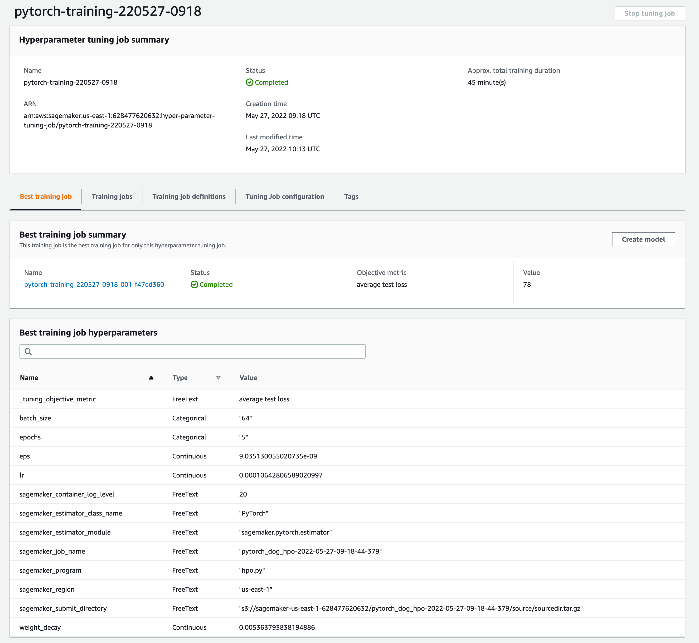

# Image Classification using AWS SageMaker

Use AWS Sagemaker to train a pretrained model that can perform image classification by using the Sagemaker profiling, debugger, hyperparameter tuning and other good ML engineering practices. This can be done on either the provided dog breed classication data set or one of your choice.

## Project Set Up and Installation
Enter AWS through the gateway in the course and open SageMaker Studio. 
Download the starter files.
Download/Make the dataset available. 

## Dataset
The provided dataset is the dogbreed classification dataset which can be found in the classroom.
The project is designed to be dataset independent so if there is a dataset that is more interesting or relevant to your work, you are welcome to use it to complete the project.

### Access
Upload the data to an S3 bucket through the AWS Gateway so that SageMaker has access to the data. 

## Hyperparameter Tuning
What kind of model did you choose for this experiment and why? Give an overview of the types of parameters and their ranges used for the hyperparameter search

Remember that your README should:
- Include a screenshot of completed training jobs
- Logs metrics during the training process
- Tune at least two hyperparameters
- Retrieve the best best hyperparameters from all your training jobs

The following image shows four training job that where completed with all their relevant information 

The following the parameters for the best model

## Debugging and Profiling

To gain insights into our model training job, we have utilized the SageMaker Debugger and Profiler. Hooks are added to the training job located in `train_model.py` and then called from the profile section in the `train_and_deploy.ipynb`. The following rules were added to the debugger profile. 

`
rules = [
 Rule.sagemaker(rule_configs.vanishing_gradient()),
 Rule.sagemaker(rule_configs.overfit()),
 Rule.sagemaker(rule_configs.overtraining()),
 Rule.sagemaker(rule_configs.poor_weight_initialization()),
 ProfilerRule.sagemaker(rule_configs.ProfilerReport()),
]
`

### Results
**TODO**: What are the results/insights did you get by profiling/debugging your model?

**TODO** Remember to provide the profiler html/pdf file in your submission.

## Model Deployment

Following is the process of deploying the trained model in `train_and_deploy.ipynb`: 

- Fit an estimator model using `hop.py` and best the best hyperparameters
- Define `ImagePredictor` for `predictor_cls`
- Define the entry_pint code that is required for inference in `infernce.py` 
- Deploy the model on a single `ml.m5.large` instance
- Load a local file image to a `bytearray` and send it via the `.predict` method to the endpoint  

-https://docs.aws.amazon.com/sagemaker/latest/dg/debugger-profiling-report.html
